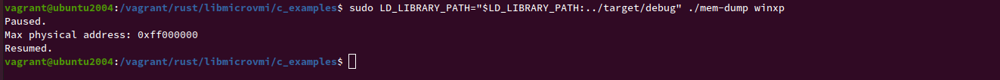

# Memory-dump example in C

In this tutorial chapter, we will run the `mem-dump.c` C example code
to dump the physical memory of a domain.

First, we will compile libmicrovmi with the Xen driver enabled:

~~~
$ cd libmicrovmi
$ cargo build --features xen
~~~

## Install cbindgen

[`cbindgen`](https://github.com/eqrion/cbindgen) is a tool for automatically generating C header files that expose
a Rust library's [FFI](https://doc.rust-lang.org/nomicon/ffi.html).

To install it:
~~~
$ cargo install --force cbindgen
~~~

## Building mem-dump C example

~~~
$ cd c_examples/
$ cmake -B build .
$ cmake --build build --target mem-dump
~~~

## Running the example

Next, let's run the example on your domain `<vm_name>`:

~~~
cd build
$ sudo LD_LIBRARY_PATH="$LD_LIBRARY_PATH:../target/debug" ./mem-dump <vm_name>
~~~

⚠️ Note: `libmicrovmi.so` has been generated by cargo into `target/debug`.
We have to set `LD_LIBRARY_PATH` so that `mem-dump` is able to find the libary.

Expected output:

