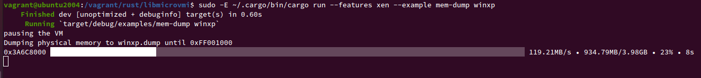

# Memory-dump example in Rust

In this tutorial chapter, we will run the `mem-dump.rs` Rust example code
to dump the physical memory of a domain.

First, we will compile libmicrovmi with the Xen driver enabled:

~~~
$ cd libmicrovmi
$ cargo build --features xen
~~~

## Running the example

Next, let's run the example on your domain `<vm_name>`:
~~~
$ sudo -E ~/.cargo/bin/cargo run --features xen --example mem-dump <vm_name>
~~~

Expected output:

### Toggle debug output

In case an error would arise, the logging output can be toggled with `RUST_LOG` env var
and offer more detailed information:
~~~
$ export RUST_LOG=debug
$ sudo -E ~/.cargo/bin/cargo run --features xen --example mem-dump <vm_name>
~~~
