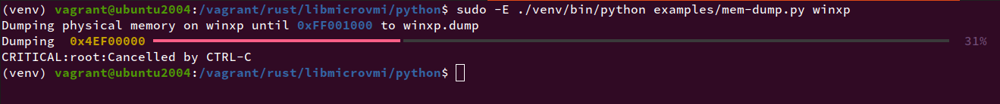

# Memory-dump example in Rust

In this tutorial chapter, we will run the `mem-dump.py` Python example to dump
the physical memory of a domain, thanks to libmicrovmi Python bindings.

First, let's create a virtualenv and install the bindings with the Xen driver enabled:

~~~
$ cd libmicrovmi/python
$ python3 -m venv venv
$ source venv/bin/activate
(venv) $ python -m pip install --upgrade setuptools
(venv) $ python -m pip install -r requirements.txt
(venv) $ ./setup.py install --features xen
~~~

## Running the example

The `examples/mem-dump.py` script is based on the [rich](https://github.com/willmcgugan/rich) library for an enhanced output.
As they are only needed for example code, the requirements are kept in a separate file.

Let's install them:

~~~
cd libmicrovmi/python
(venv) $ python -m pip install -r examples/requirements.txt
~~~

Now you can run the example on your domain `<vm_name>`:
~~~
$ sudo -E ./venv/bin/python examples/mem-dump.py <vm_name>
~~~

Expected output:

